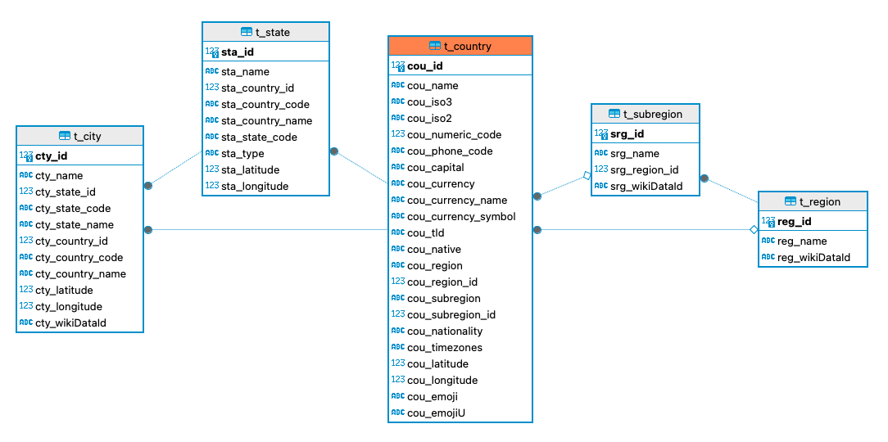

## Data V1: COUNTRY
Get extracted csv data from :
* https://github.com/dr5hn/countries-states-cities-database

  
#### PRIMARY KEY
* pk_t_country
* pk_t_region
* pk_t_subregion
* pk_t_state
* pk_t_city

#### FOREIGN KEY
* t_country: 
  * fk_cou_region_id => t_region
  * fk_cou_subregion_id => t_subregion
* t_region:
* t_subregion:
  * fk_srg_region_id => t_region
* t_state:
  * fk_sta_country_id => t_country
* t_city:
  * fk_cty_country_id => t_country
  * fk_cty_state_id => t_state
